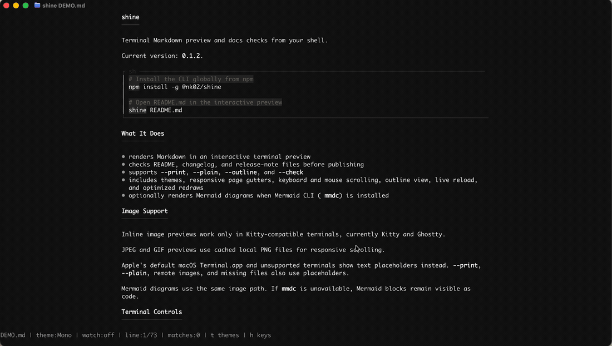

# shine

`shine` is a terminal Markdown previewer and docs checker for README, changelog, and release-note workflows.

Preview Markdown without leaving the terminal, then run quick checks for common publishing issues before your docs land.

Current release: [v0.1.2](https://github.com/Nithish-Yenaganti/shine/releases/tag/v0.1.2). Prebuilt release binaries support macOS and Linux on x86-64 and ARM64.

[](https://youtu.be/0RvUFqgH8io?si=4FxvQ7o0P_xjlJrB)

[Watch the full demo on YouTube](https://youtu.be/0RvUFqgH8io?si=4FxvQ7o0P_xjlJrB).

## Features

- Markdown files, stdin, and non-interactive output
- TUI preview with keyboard and mouse scrolling, search, outline, help, themes, responsive page gutters, and optimized redraws
- Tables, callouts, task lists, code blocks, links, and inline styles
- Local image previews in Kitty/Ghostty-compatible terminals
- Optional Mermaid previews through Mermaid CLI (`mmdc`)
- Docs checks for headings, duplicate titles, image alt text, links, images, and table readability
- Non-interactive commands: `--print`, `--plain`, `--outline`, `--check`
- Shell completions for bash, zsh, fish, and PowerShell

## Install

Choose one installation method.

With npm (Node.js 18+, macOS or Linux on x64/ARM64):

```sh
npm install -g @nk02/shine@0.1.2
shine version
shine README.md
```

The npm installer downloads the matching binary from the GitHub release. Run the preview command in a folder containing a `README.md`, or supply a different Markdown file path.

With Go 1.24.2 or newer:

```sh
go install github.com/Nithish-Yenaganti/shine/cmd/shine@v0.1.2
shine version
```

Ensure Go's binary directory is on your `PATH`. You can also download a matching archive and checksum file from the [v0.1.2 release](https://github.com/Nithish-Yenaganti/shine/releases/tag/v0.1.2).

For a quick check without opening the interactive terminal UI:

```sh
shine --plain README.md
shine --outline README.md
shine --check README.md
```

Expect the document text, its heading outline, and a docs-check result respectively. Docs warnings describe the input document; they do not necessarily indicate an installation failure.

Build the current source checkout:

```sh
git clone https://github.com/Nithish-Yenaganti/shine.git
cd shine
go build -o bin/shine ./cmd/shine
bin/shine version
bin/shine --plain README.md
```

## Usage

```sh
# Open README.md in the interactive preview
shine README.md

# Preview README.md and reload when it changes
shine --watch README.md

# Preview Markdown from stdin
cat README.md | shine

# Print the styled Markdown output once
shine --print README.md

# Print plain text output without styling
shine --plain README.md

# Show the document heading outline
shine --outline README.md

# Check README.md for common docs issues
shine --check README.md
```

## Image Previews

Local images render inline in the interactive TUI on Kitty-compatible terminals, currently Kitty and Ghostty. Image paths resolve relative to the Markdown file, so `` works from `README.md`.

JPEG and GIF previews are cached as local PNG files to keep image-heavy scrolling and theme changes responsive.

Unsupported terminals, including Apple's default macOS Terminal.app, show a text placeholder instead. `--print`, `--plain`, remote images, and missing files also use placeholders.

Mermaid code blocks can render as inline diagrams when `mmdc` from Mermaid CLI is installed. Without `mmdc`, or outside supported image terminals, Mermaid blocks stay readable as code with a short fallback note.

## Docs Review

Use `--check` before publishing docs:

```sh
shine --check README.md
```

Checks include:

- heading structure
- duplicate headings
- missing image alt text
- broken local links and images
- raw URL link text
- hard-to-scan tables

Example output:

```text
3 markdown warning(s):
- heading "Install" jumps from H1 to H3
- block 5 link file not found: ./missing.md
- block 7 table row 2 column 3 is very long
```

Other commands:

```sh
shine version
shine --version
shine completions zsh > _shine
```

## Keyboard

```text
q          quit
j/down     scroll down
k/up       scroll up
mouse      scroll
d/space    half-page down
u          half-page up
g          top
G          bottom
/          search
n          next search result
N          previous search result
o          heading outline
r          reload file
t/T        theme picker
h/H/F1     show help panel
?          toggle help panel
```

Mouse wheel scrolling is tuned for terminal use. Non-wheel mouse input is filtered before redraws, and overlays such as help, outline, search, and the theme picker block document scrolling behind them.

## Themes

`mono` is the default black-background theme. Press `t` or `T` in the TUI to switch themes.

- Tomorrow Night: `tomorrow-night`
- GitHub Light: `github`
- Mono: `mono`
- Catppuccin Latte: `catppuccin-latte`
- Catppuccin Mocha: `catppuccin-mocha`
- Claude: `claude`
- Everforest Dark: `everforest`
- Jellybeans: `jellybeans`
- Gotham: `gotham`

Aliases: `daylight`, `latte`, `cappuccino`, `mocha`, `midnight`.

## Release

Tagged releases are built by GitHub Actions through GoReleaser.

```sh
goreleaser check
goreleaser release --snapshot --clean
```

For maintainers preparing a **new** release, update the version in the source and package metadata first. The commands below illustrate the existing v0.1.2 release; do not recreate or overwrite an already-published tag. Substitute the new version when publishing:

```sh
git tag v0.1.2
git push origin v0.1.2
# Wait for the GitHub release workflow and all release assets
npm run publish:npm -- --access public
```

The npm publish command checks that the version in `package.json` is not already published and that its GitHub release contains every required asset. Version `0.1.2` is already released.

Checklist:

- `go test ./...`
- `go vet ./...`
- `go build -o bin/shine ./cmd/shine`
- `npm run test:npm`
- `npm run test:publish`
- `bin/shine --check README.md`
- `goreleaser check`

## Development

```sh
go test ./...
go vet ./...
go build -o bin/shine ./cmd/shine
npm run test:npm
npm run test:publish
```

## Community

- Read [CONTRIBUTING.md](CONTRIBUTING.md) before opening a pull request.
- Use [SUPPORT.md](SUPPORT.md) for help and issue guidance.
- Report vulnerabilities through [SECURITY.md](SECURITY.md).
- Follow the project [Code of Conduct](CODE_OF_CONDUCT.md).

## License

MIT. See [LICENSE](LICENSE).
